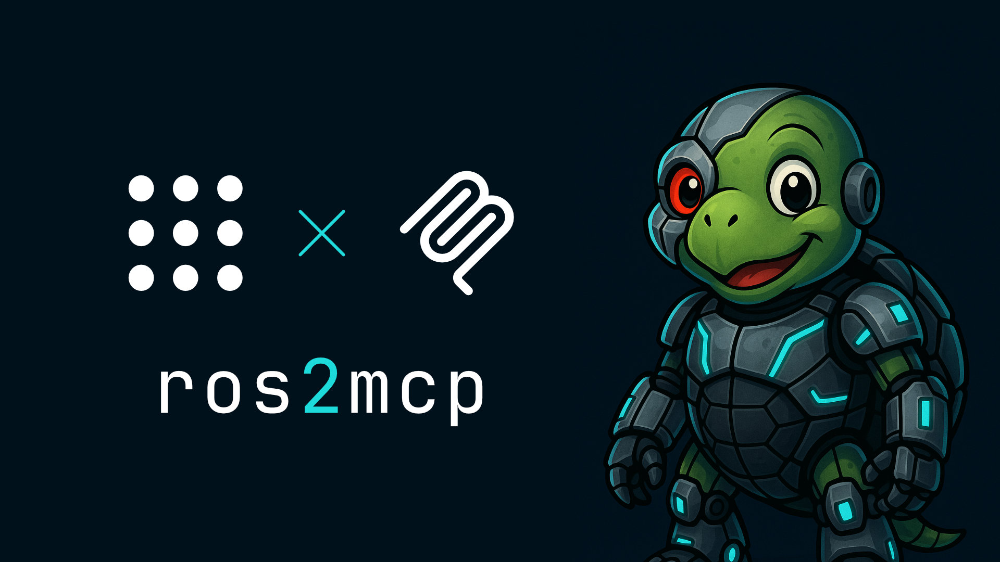

Expose arbitrary [ROS 2](https://www.ros.org/) services as [MCP](https://modelcontextprotocol.io/) tools and list topics as resources.

# Setup

1. Clone the repository:
```bash
git clone https://github.com/nico0302/ros2mcp.git
```

2. Setup the environment and run the demo with [Pixi](https://pixi.sh/dev/installation/)
```bash
pixi run demo-tb4
```

3. Connect a MCP client to the demo server on `http://localhost:8080`
