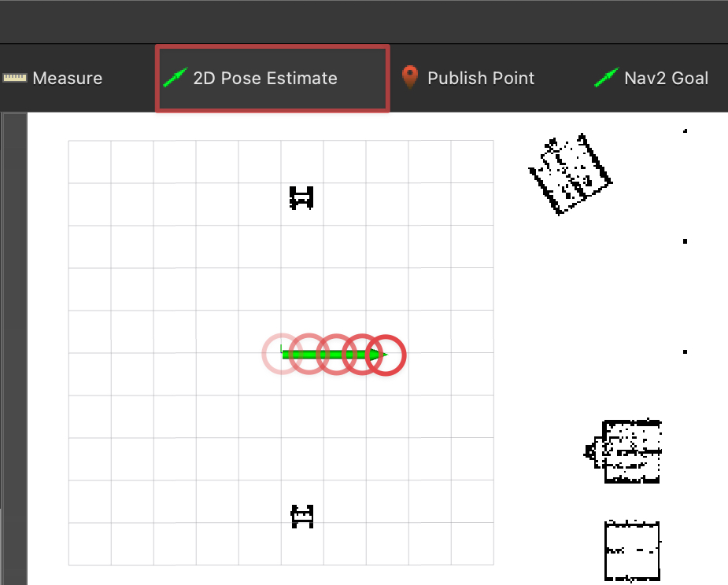

Expose arbitrary [ROS 2](https://www.ros.org/) services and topics as [MCP](https://modelcontextprotocol.io/) tools and list topics as resources.


The `mcp_server` node can translate any ROS topic and service into a MCP resource or tool (including source comments as parameter descriptions).

<iframe width="560" height="315" src="https://www.youtube-nocookie.com/embed/yN2vLpf2-HE?si=RkVk6Or2y_l09XCz" title="YouTube video player" frameborder="0" allow="accelerometer; autoplay; clipboard-write; encrypted-media; gyroscope; picture-in-picture; web-share" referrerpolicy="strict-origin-when-cross-origin" allowfullscreen></iframe>

# Demo Setup

The demo can be run on Linux, macOS, and Windows using [Pixi](https://pixi.sh/dev/installation/).

1. Clone the repository.
```bash
git clone https://github.com/nico0302/ros2mcp.git
```

2. Start Gazebo and Rviz2 and the demo node:
```bash
pixi run demo-tb4
```
This might take a while on the first run as it downloads the necessary assets.

3. After Gazebo and Rviz2 are running, select the `2D Pose Estimate` tool in Rviz2 to set the robot's initial position by clicking in the center of the map and dragging to right:


4. Connect a MCP client to the demo server on `http://localhost:8080`
This project includes a simple MCP client that can be run with:
```bash
# make sure to set your OPENAI_API_KEY environment variable
export OPENAI_API_KEY=your_openai_api_key
pixi run demo-client
```
